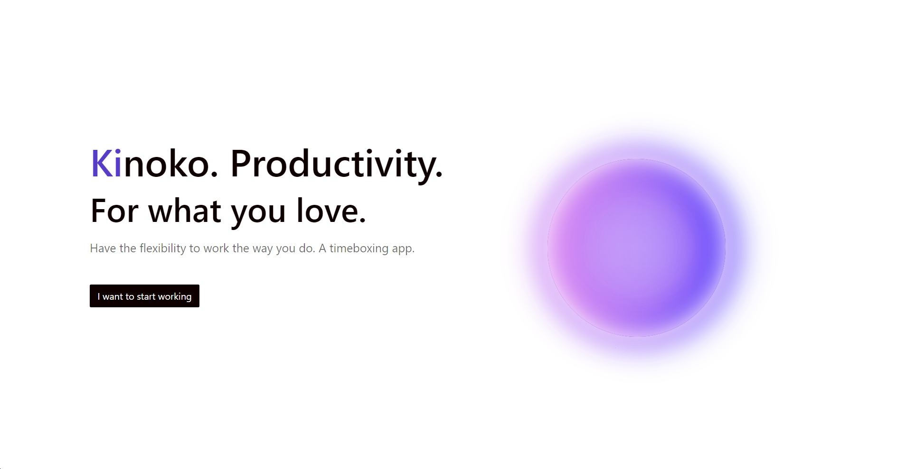

# Kinoko

Kinoko is a timeboxing web application that allows you to work for long periods of time without getting distracted or burning out. You can set intervals of working and resting as you prefer.

Kinoko uses a tag system that allows you to track your work time in a more flexible and intelligent way. You can see a visual representation of your hours of work in the "Mushroom Forest" or you can access an statistics dashboard.

## Table of Contents

*   [Basic Usage](#basic-usage)
*   [Tracking your time](#tracking-your-time)
    *   [Tags](#tags)
    *   [Goals](#goals)
    *   [Mushroom Forest](#mushroom-forest)
*   [Frequently Asked Questions](#frequently-asked-questions)
<!-- *   [Screenshots](#screenshots) -->

## Basic Usage

Kinoko can be used as a very straightforward timeboxing application, for those that aren't interested in logging their time. In this case, all you need to do is create a new task, set the duration and go straight in to "Start Timeboxing". After creating your timeboxes, you can start working normally.

In other words, it's fine to ignore tags completely.

## Tracking your time

Numbers can be a huge motivator for working everyday, because it's something that is very tangible. You can clearly exactly how much you are working, if you are putting more hours in than usually or maybe if you are slacking off and need to take it more seriously. They provide for a way of correcting our work habits or just to alleviate our doubts of whether we are making progress or not.

But tracking itself takes time, and for that reason Kinoko aims to make things easier and do it for you. So that you can phocus just on working. And it does so by using a tag system for all of your different tasks.

### Tags

Tracking is easy when it is one single thing. But once you start tracking several things, or worse, when you want to track things that are related to each other, you quickly realize how quickly things get messy.

In other words, tracking how much time you spent reading 1Q84 by Haruki Murakami is easy. But what happens when the next book you read is by Mishima, a different author. And let's say, for example, that you want to know how many hours you spent reading japanese. Your best option is to create an excel sheet and log it there. That's a bit cumbersome, but fine.

But what happens if you read a novel in english and you want to know how many hours have you read, no matter the language? What happens when we go from 3 books to 300 books read? Logging each one of them, knowing how much time we spent in a particular book, in a particular language or reading in general becomes a much more demanding task.

Kinoko tag system precisely tackles that issue. When you are doing a task like "Reading Murakami's 1Q84", you are logging your hours in three different tags: #Reading, #Japanese, and #Murakami. You have the flexibility to log your work in any way you want to, targetting the statistics that you consider most relevant.

### Goals

When you create a task in your dashboard, you have the option to set a goal for a particular tag. You can see your progress in each of them when you access your statistics page.

## Mushroom Forest

A visual representation of your hard work, the total amount of hours you have worked inside the app. For every new hour of work, you will see a new "kinoko" (mushroom). Their size and color are randomized.

## Frequently Asked Questions

##### Task, timeboxes, tags... I am having a hard time understanding the difference between the three

If you haven't done timeboxing before I would say that is completely normal. Here is an example:

Task: Read Murakami - Duration: 1 hour - Tags: #Japanese #Reading.
Timebox 1: 10 mins work.
Timebox 2: 10 mins break.

A task is the particular activity you are doing at the moment, something concrete. This activity can enter in one or several categories, which we call tags. You will do a task for a total duration of an hour, but it will be in intervals of 10 mins. 10...20...30...40... until you are done.

In the end, that hour of work will be logged inside the tag or tags associated with it.

##### How long should my timeboxes be?

This is completely personal preference, and it depends on the activity you are doing. Personally, I prefer 7 mins of work and 3 minutes of break. Because I enjoy the constant switching between working and resting, I feel like it keeps me on my toes. Most people seem to like doing Pomodoro, which is 25 minutes of work and 5 resting. Whatever is the most comfortable to you and keeps you in the zone is fine.

<!-- ## Screenshots -->
